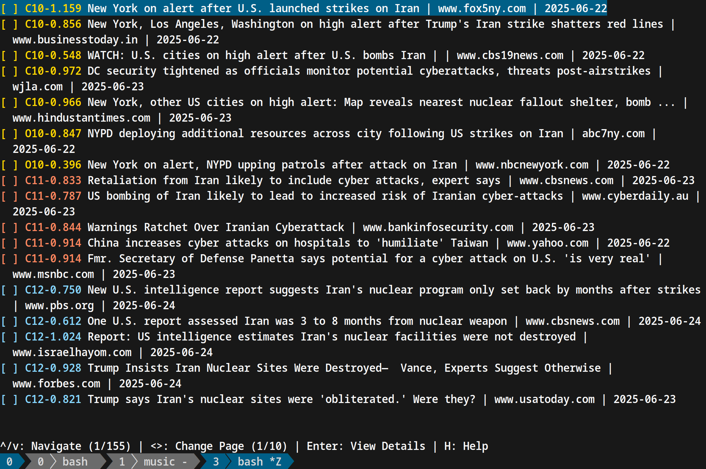

# HDBSCAN - Density Clustering Algorithm

## About

This repository contains an implementation of the [HDBSCAN](https://hdbscan.readthedocs.io/en/latest/how_hdbscan_works.html) algorithm in golang. It better documents some code from [Belval/hdbscan](https://github.com/Belval/hdbscan) via [humilityai/hdbscan](https://pkg.go.dev/github.com/humilityai/hdbscan) and [urnetwork/cluster](https://github.com/urnetwork/cluster).

Ultimately, [Python](https://github.com/scikit-learn-contrib/hdbscan) and maybe [Rust](https://docs.rs/hdbscan/latest/hdbscan/) have better implementations, and if you arrive at this repository, you might consider switching to those languages and operating across a database layer rather than continuing in golang. 

## Usage

`go get -u github.com/NunoSempere/hdbscan`

```go
package main

import (
	"fmt"
	"github.com/NunoSempere/hdbscan/hdbscan"
)

func main() {
	data := [][]float64{
		[]float64{1, 2, 3},
		[]float64{1, 2.2, 3},
		[]float64{3.2, 2, 1},
		[]float64{3.1, 2, 1},
		[]float64{5, 5, 5},
		[]float64{5.2, 5, 5},
		[]float64{7, -1, 0},
	}
	minimumClusterSize := 2
	minimumSpanningTree := false

	clustering, err := hdbscan.NewClustering(data, minimumClusterSize)
	if err != nil {
		fmt.Println(err)
		panic(err)
	}

	// clustering = clustering.Verbose()
	clustering = clustering.OutlierDetection()
	clustering.Run(hdbscan.EuclideanDistance, hdbscan.VarianceScore, minimumSpanningTree)

	printClusters(*clustering, data)
}

func printClusters(clusters hdbscan.Clustering, data [][]float64) {
	for i, cluster := range clusters.Clusters {
		fmt.Printf("\nCluster %d: %+v", i, cluster)
		ps := []int{}

		fmt.Printf("\n  Central points: ")
		for _, p := range cluster.Points {
			ps = append(ps, p)
		}
		ps = unique(ps)
		for _, p := range ps {
			fmt.Printf("%v, ", data[p])
		}

		fmt.Printf("\n  Outlier points: ")
		for _, o := range cluster.Outliers {
			fmt.Printf("%v, ", data[o.Index])
		}
		fmt.Println()
	}
}

func unique[A comparable](input []A) []A {
	seen := make(map[A]bool)
	var result []A
	for _, v := range input {
		if !seen[v] {
			seen[v] = true
			result = append(result, v)
		}
	}
	return result
}
```

This produces the following output:

```
Cluster 0: &{id:1 parent:0xc000180098 children:[] score:1.1125369292536007e-308 delta:1 size:2 variance:1.7976931348623157e+308 lMin:0 distanceDistribution:0xc0001a4080 largestDistance:0.10000000000000009 Centroid:[1 2.1 3] Points:[1 0] Outliers:[]}
  Central points:[1 2.2 3], [1 2 3],
  Outlier points:

Cluster 1: &{id:3 parent:0xc0001800a8 children:[] score:1.1125369292536007e-308 delta:1 size:2 variance:1.7976931348623157e+308 lMin:0 distanceDistribution:0xc0001a40a0 largestDistance:0 Centroid:[5 5 5] Points:[4 4] Outliers:[{Index:5 NormalizedDistance:1}]}
  Central points:[5 5 5],
  Outlier points:[5.2 5 5],

Cluster 2: &{id:5 parent:<nil> children:[0] score:0.028526417216404785 delta:1 size:2 variance:70.11045182532958 lMin:0 distanceDistribution:0xc0001a40c0 largestDistance:2.471841418861655 Centroid:[5.1 0.5 0.5] Points:[6 2] Outliers:[{Index:3 NormalizedDistance:1}]}
  Central points:[7 -1 0], [3.2 2 1],
  Outlier points:[3.1 2 1],
```

You can see a more elaborate example [here](https://github.com/NunoSempere/eye-of-sauron/blob/master/client/articles/src/cluster.go) that creates embeddings for a list of texts using the OpenAI embedding API, runs hbdscan on those embeddings, and then wrangles the hbdscan into an output to produce clusters for articles:



### Options

- `Verbose()` will log the progress of the clustering to stdout.
- `Voronoi()` will add all points not placed in a cluster in the final clustering to their nearest cluster. All unassigned data points outliers will be added to their nearest cluster.
- `OutlierDetection()` will mark all unassigned data points as outliers of their nearest cluster and provide a `NormalizedDistance` value for each outlier that can be interpreted as the probability that the data point is an outlier of that cluster.
- `NearestNeighbor()` specifies if an unassigned points "nearness" to a cluster should be based on it's nearest assigned neighboring data point in that cluster (default "nearness" is based on distance to centroid of cluster).
- `Subsample(n int)` specifies to only use the first `n` data points in the clustering process. This speeds up the clustering. The remaining data points can be added to clusters using the `Assign(data [][]float64)` method after a successful clustering.
- `OutlierClustering()` will create a new cluster for the outliers of an existing cluster if the number of outliers is equal to or greater than the specified minimum-cluster-size.

## Contributing 

Contributions are welcome, particularly around:

- Finding out why the algorithm produces duplicate indexes for central points
- Sanity-checking against other implementations 
- Add a utility to double-check that all points are in at least one cluster
